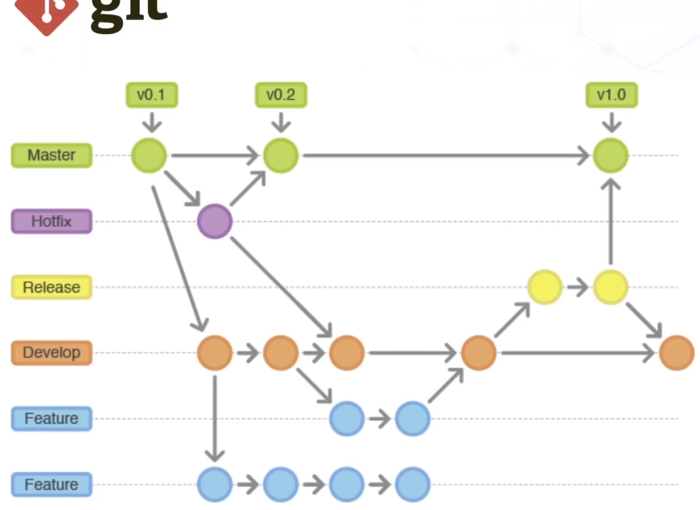

# Grupo 6 - Proyecto de Servicios

**DEVELOP**: Se van agregando las funcionalidades aca, no se trabaja directo sobre el branch, se crea un branch nuevo por cada funcionalidad (puntos azules), cuando el desarrollador terminó la funcionalidad se hace un *MERGE REQUEST* hacia el branch **DEVELOP**, se hace una revision del codigo entre los programadores viendo que se hace y si está bien, si se acepta pasa de (1.0.0 a 1.1.0)

**RELEASE**: Cuando todas las funcionalidades estan agregadas correctamente en **DEVELOP** se transfiere todo a este branch, signfica que está en preproduccion, no se hacen mas agregados de funcionalidades y generalmente se testea todo el sistema, una vez comprobado se hace un merge al main, las version pasa de (1.0.0 a 2.0.0)

**HOTFIX**: Se crea un hotfix del main por cada error a arreglar, una vez arreglado se hace un merge al main y uno a la rama de develop, los cambios lo marcamos aumentando el numero de version cada 0.0.1 (1.0.1 a 1.0.2 por ejemplo el cambio)

**MASTER O MAIN**: Contiene las ultimas funcionalidades del proyecto, es el ultimo paso a actualizar

# Guia:

Descargan el proyecto, con la consola se colocan en el directorio y ponen

- git checkout develop

Con ese comando se van a parar en el branch develop que va a tener las ultimas funcionalidades

Para crear una funcionalidad tienen que crear un branch para ustedes con el nombre que quieran, parados en la rama develop ponen

- git checkout -b funcionalidad1

Una vez que hayan terminado la funcionalidad, usando el add y hechos los commit, falta el push pero hagan un rebase por las dudas, sirve para actualizar su rama a las nuevas funcionalidades que pudieron agregar otras personas mientras ustedes desarrollaban la suya, para hacer simple pongan

- git pull -r origin develop

Si les dice que hay algun conflicto pongan

- git rebase --abort

y pregunten, si está todo bien pongan 

- git push

Les va a decir que la rama que tratan de pushear no existe, que en realidad deberian copiar el codigo que les menciona ahi y usarlo

Lo usan y ya esta

